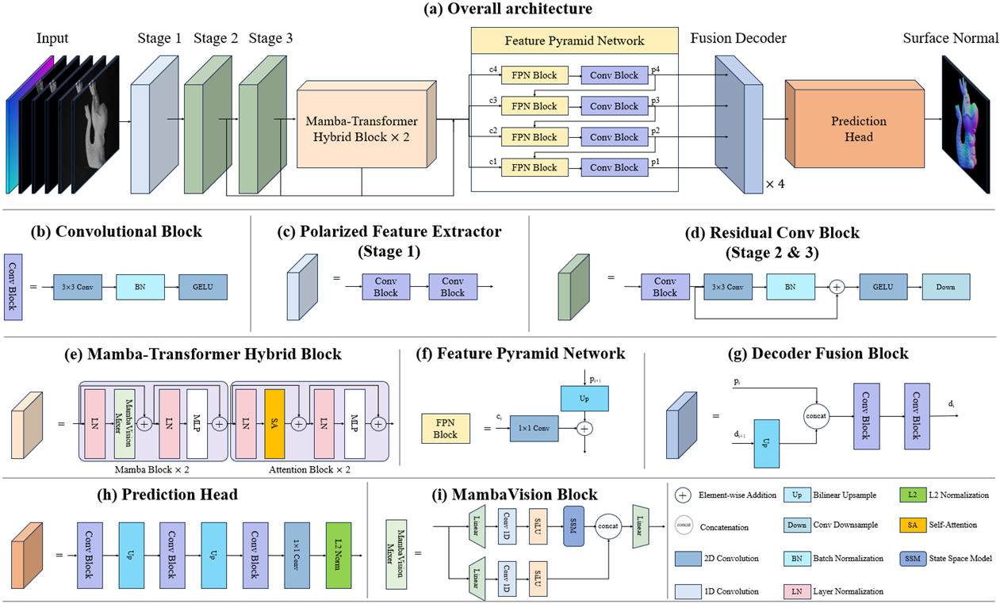

<div align="center">

# Mamba-SfP

**A Mamba-based framework for underwater Shape-from-Polarization (SfP) normal reconstruction**

[](https://github.com/TBD)
[](https://www.python.org/)
[](https://pytorch.org/)
[](https://developer.nvidia.com/cuda-toolkit)
[](https://arxiv.org/abs/TBD)
[](https://pan.baidu.com/s/TBD?pwd=TBD)
[](https://ieeexplore.ieee.org/document/TBD)
[](https://www.sciencedirect.com/science/article/pii/TBD)

</div>

<p align="center">
  
</p>

---

## Overview

`Mamba-SfP` is a research codebase for underwater 3D surface normal reconstruction from polarization cues.

This README is a polished template for release. Sections marked `TBD` are intentionally left blank so you can fill them later.

## Architecture

<p align="center">
  
</p>

## Highlights

- End-to-end training pipeline for underwater SfP normal estimation.
- Distributed multi-GPU training with `DistributedDataParallel`.
- Sliding-window inference and per-pixel angular-error visualization.
- Built-in summary export for Table-1-style benchmark metrics.

## Project Structure

```text
Mamba-SfP/
|-- README_img/
|   |-- Network.png
|   `-- 3D.gif
|-- Underwater Dataset/
|   |-- Baseline_Data/
|   |-- train_list_withoutcleanwater.csv
|   |-- val_list_withoutcleanwater.csv
|   `-- test_list_withoutcleanwater.csv
|-- train.py
|-- Angle_error_map.py
|-- config.py
|-- Datasets.py
|-- requirements.txt
`-- environment.yml
```

## Environment Setup

### Option 1: Conda (recommended)

```bash
conda create -n mamba-sfp python=3.10 -y
conda activate mamba-sfp
pip install -r requirements.txt
```

### Option 2: Use provided `environment.yml`

```bash
conda env create -f environment.yml
conda activate tongyong
```

## Data Preparation

Put dataset files in:

```text
./Underwater Dataset/Baseline_Data/
```

Required CSV index files:

- `Underwater Dataset/train_list_withoutcleanwater.csv`
- `Underwater Dataset/val_list_withoutcleanwater.csv`
- `Underwater Dataset/test_list_withoutcleanwater.csv`

Dataset download link: `TBD`

## Training

Run distributed training:

```bash
python train.py --train_batch_size 24 --val_batch_size 4 --epochs 1000 --checkpoints_dir ./pt/Mamba/
```

Resume from a checkpoint:

```bash
python train.py --model_name /700.pth --checkpoints_dir ./pt/Mamba/
```

TensorBoard logs are written to `./runs` by default.

## Evaluation and Visualization

Generate predicted normal maps and angular error maps:

```bash
python Angle_error_map.py --ckpt_path ./pt/Mamba/700.pth --results_dir ./results_sfp --error_maps_dir ./error_maps --summary_path ./table1_metrics.txt --nprocs 1
```

Outputs:

- Predicted normal maps: `./results_sfp`
- Error heatmaps: `./error_maps`
- Quantitative summary: `./table1_metrics.txt`

## Quantitative Result (Current Local Summary)

| Metric | Value |
|---|---:|
| Images evaluated | 72 |
| Valid pixels | 9,593,790 |
| Mean angular error (deg) | 14.0704 |
| Median angular error (deg) | 10.4160 |
| RMSE (deg) | 18.4127 |
| Accuracy < 11.25 deg (%) | 53.1000 |
| Accuracy < 22.5 deg (%) | 80.6979 |
| Accuracy < 30.0 deg (%) | 90.3955 |

## Checkpoints

Pretrained model link: `TBD`

## Citation

Paper link: `TBD`

```bibtex
@article{mamba_sfp_2026,
  title   = {TBD},
  author  = {TBD},
  journal = {TBD},
  year    = {2026}
}
```

## Acknowledgements

This project builds on ideas and/or implementations from:

- [DEA-Net: Single image dehazing based on detail-enhanced convolution and content-guided attention](https://github.com/cecret3350/DEA-Net)
- [Deep Color Consistent Network for Low Light-Image Enhancement](https://github.com/Ian0926/DCC-Net)
- [Shape from Polarization for Complex Scenes in the Wild](https://github.com/ChenyangLEI/sfp-wild)

## To Fill Later

- [ ] Official paper title and link.
- [ ] Pretrained checkpoints and download instructions.
- [ ] Dataset release/download page.
- [ ] Full benchmark table and comparison methods.
- [ ] License section.
